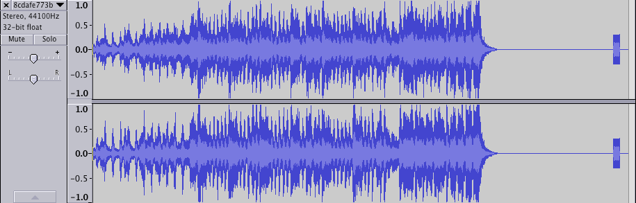
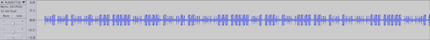

# 07 File Repair

The flag is stored somewhere in a corrupted file.

## Write-up

We are only told the file is corrupted, we are not told what kind of file it
is. Let's see if there is any clue at the beginning of the file:

```
vagrant@vagrant-ubuntu-trusty-64:/vagrant$ hexdump -C -n 128 8cdafe773bf36efe77c88cebceee84f7
00000000  52 45 44 41 43 54 45 44  00 00 00 22 10 00 10 00  |REDACTED..."....|
00000010  00 05 f9 00 32 21 0a c4  42 f0 00 21 a8 17 2b 52  |....2!..B..!..+R|
00000020  5e 6a 20 58 64 a1 e8 48  56 1b 1c c8 58 46 84 00  |^j Xd..HV...XF..|
00000030  00 28 20 00 00 00 72 65  66 65 72 65 6e 63 65 20  |.( ...reference |
00000040  6c 69 62 20 31 2e 33 2e  30 20 32 30 31 33 30 35  |lib 1.3.0 201305|
00000050  32 36 00 00 00 00 ff f8  c9 18 00 c2 4c fc fb fc  |26..........L...|
00000060  fa fc df fc b8 fc 91 fc  80 fc d8 b5 39 ff 59 69  |............9.Yi|
00000070  00 08 ff f0 eb f8 38 6a  21 1d 1c 56 f0 6e 52 7f  |......8j!..V.nR.|
00000080  5a b0 f4 5e c6 a5 e7 a1  cd c5 08 9c 25 79 db 12  |Z..^........%y..|
00000090  d9 98 b1 37 0f 1a b6 79  48 f5 99 c2 43 89 66 1e  |...7...yH...C.f.|
000000a0  56 99 5a d0 95 d8 85 84  2e ea 1c 0c 0f 91 f7 3a  |V.Z............:|
000000b0  10 af 20 90 95 b8 98 a3  03 fe ff e5 63 82 04 8b  |.. .........c...|
000000c0  06 53 b9 81 ca 54 62 81  09 00 a1 21 af 27 87 07  |.S...Tb....!.'..|
```

The magic has been purposefully removed, however, we can see something that may
be useful to identify the file a bit further down "reference lib 1.3.0
20130526". Searching for this string on Google found results related to the
FLAC file format. The string is not quite the same though, so that has also
been tampered with.

I downloaded FLAC sample file from
http://www.linnrecords.com/linn-downloads-testfiles.aspx to use as a reference
for how the file should be.

```
vagrant@vagrant-ubuntu-trusty-64:/vagrant$ file tone16bit.flac
tone16bit.flac: FLAC audio bitstream data, 16 bit, stereo, 44.1 kHz, 220500 samples

vagrant@vagrant-ubuntu-trusty-64:/vagrant$ hexdump -C -n128 tone16bit.flac
00000000  66 4c 61 43 00 00 00 22  10 00 10 00 00 05 fe 00  |fLaC..."........|
00000010  0a 52 0a c4 42 f0 00 03  5d 54 4d 28 58 26 d1 5a  |.R..B...]TM(X&.Z|
00000020  2d 38 b4 d0 2b 4d c2 d3  f4 e1 03 00 00 12 00 00  |-8..+M..........|
00000030  00 00 00 00 00 00 00 00  00 00 00 00 00 00 10 00  |................|
00000040  04 00 00 28 20 00 00 00  72 65 66 65 72 65 6e 63  |...( ...referenc|
00000050  65 20 6c 69 62 46 4c 41  43 20 31 2e 31 2e 34 20  |e libFLAC 1.1.4 |
00000060  32 30 30 37 30 32 31 33  00 00 00 00 81 00 20 00  |20070213...... .|
00000070  00 00 00 00 00 00 00 00  00 00 00 00 00 00 00 00  |................|
```

Initially it looks like the magic "fLaC" (aka "FLAC stream marker") was
replaced with "REDACTED" and further down the file "libFLAC" was changed to
just "lib".

We need to remove the extra bits and then re-write the FLAC stream marker in
ASCII:

```
dd if=8cdafe773bf36efe77c88cebceee84f7 of=8cdafe773bf36efe77c88cebceee84f7.flac skip=4 iflag=skip_bytes

vagrant@vagrant-ubuntu-trusty-64:/vagrant$ hexdump -C -n128 8cdafe773bf36efe77c88cebceee84f7.flac
00000000  43 54 45 44 00 00 00 22  10 00 10 00 00 05 f9 00  |CTED..."........|
00000010  32 21 0a c4 42 f0 00 21  a8 17 2b 52 5e 6a 20 58  |2!..B..!..+R^j X|
00000020  64 a1 e8 48 56 1b 1c c8  58 46 84 00 00 28 20 00  |d..HV...XF...( .|
00000030  00 00 72 65 66 65 72 65  6e 63 65 20 6c 69 62 20  |..reference lib |
00000040  31 2e 33 2e 30 20 32 30  31 33 30 35 32 36 00 00  |1.3.0 20130526..|
00000050  00 00 ff f8 c9 18 00 c2  4c fc fb fc fa fc df fc  |........L.......|
00000060  b8 fc 91 fc 80 fc d8 b5  39 ff 59 69 00 08 ff f0  |........9.Yi....|
00000070  eb f8 38 6a 21 1d 1c 56  f0 6e 52 7f 5a b0 f4 5e  |..8j!..V.nR.Z..^|
```

Then overwrite CTED with the FLAC stream marker in ASCII, meaning byte 0 of the
stream is 0x66, followed by 0x4C 0x61 0x43

```
vagrant@vagrant-ubuntu-trusty-64:/vagrant$ vim 8cdafe773bf36efe77c88cebceee84f7.flac

:%!xxd

<enter replace mode and edit the bytes>

:%!xxd -r

:wq
```

The file was now identified as FLAC:

```
vagrant@vagrant-ubuntu-trusty-64:/vagrant$ file 8cdafe773bf36efe77c88cebceee84f7.flac
8cdafe773bf36efe77c88cebceee84f7.flac: FLAC audio bitstream data, 16 bit, stereo, 44.1 kHz, 2205719 samples
```

The file will play the audio now!

The audio has noticeable clip at the start and noise at the end.

I was expecting it to be a voice reading out the flag or something, but it
turned out to be music instead.

Another way I was expecting the flag to be hidden was something like:
http://hackaday.com/2011/05/26/hidden-messages-in-audio/

I tried opening the file in audacity, however, it crashes when loading it, the
file format isn't completely correct yet. Perhaps the change to "reference lib"
is causing this.

At this point I started reading through the [FLAC file
format](https://xiph.org/flac/format.html#metadata_block_streaminfo). Then
created script to process the file and check the format for any corruption to
the specification.

References:
* https://xiph.org/flac/format.html#frame
* http://www.xiph.org/vorbis/doc/v-comment.html
* https://github.com/mewkiz/flac/blob/master/meta/vorbiscomment.go

I tried using the python module
[struct](https://docs.python.org/2/library/struct.html) which was useful at
first but then I needed to operate on bits and struct is more suitable for
processing bytes.

Switched from struct to
[bitstring](http://pythonhosted.org/bitstring/reading.html) which was exactly
what I needed.

Using my script I found an error:

```
Metadata Block Header
 Bytes: 0x84000028
 Last flag: True
 Type: 4 (Vorbis Comment)
 Length: 40
 VORBIS_COMMENT
  Bytes: 0x200000007265666572656e6365206c696220312e332e3020323031333035323600000000fff8c918
  vendor_length: 536870912
  vendor_string: reference lib 1.3.0 20130526
Frame Header
 Bytes: 0x00c24cfc
 sync_code: 00000000110000
 reserved1: 1
 blocking_strategy: 0
 block_size_in_ic_samples: 0100
 sample_rate: 1100
 channel_assignment: 1111
 sample_size: 110
 reserved2: 0
ERROR: Bad sync_code
```

The frame should start with fff8 or fff9 (11111111111110), however, due to the
vendor string being tampered which, the sync_code is consumed by the vorbis
comment.

I modified the script further to patch the file if it encounters this
particular issue and output the repaired version of the file.

Now the file loaded in audacity. Additionally, the clip at the beginning was
gone.



I tried all the obvious tricks in audacity to find a message hidden in the
spectogram but there was nothing.

The noise at the end of the file was still present. It also appeared
intentional. Zooming in, the noise appears to have two states, perhaps
representing binary. There was enough spacing that it appeared to be a long
series grouped by 5 bits. Though they were mixed in with three sets of four
bits. Those with four bits were identical: 0010. Perhaps a boundary. Also the
bits are never split or alternating like 10101 or 11001. This clearly appears
to be something to decode, and hopefully is the flag.



Since the 5 bits were so prominent I looked for any kind of 5 bit encoding and
came across [Baudot](https://en.wikipedia.org/wiki/Baudot_code). But after some
attempts this did not seem to work.

I also wondered if it was DTMF signal. I cropped the final noise segment and
ran it through minimodem at various bits-per-second. While it output some
strings, nothing looked promising.

```
for bps in $(seq 1000 10 8000); do
    minimodem -5 -f ./8cdafe773bf36efe77c88cebceee84f7.repaired.cropped.wav ${bps}
done
```

Checking Morse code references they used variable lengths. But the numbers were
all 5 bits wide.

Here's how it would decode if it were Morse:

```
Bits    Morse
00001	4
00001	4
10000	6
0010	F?
00111   2
11111	0
00000	5
11110	9
10000	6
0010	F?
11000	7
00000	5
00111	2
11111	0
00001	4
11100	8
10000	6
01111	1
11000	7
10000	6
10000	6
00000	5
00111	2
11111	0
00000	5
00001	4
10000	6
11100	8
10000	6
00000	5
00111	2
11111	0
00000	5
00111	2
10000	6
11110	9
10000	6
11000	7
10000	6
11100	8
11000	7
00001	4
00111	2
11111	0
00000	5
00011	3
11000	7
00001	4
11000	7
00000	5
10000	6
10000	6
10000	6
10000	6
00011	3
0010	F?
```

Did the numbers refer to letters, e.g. 1=a, 2=b, it didn't seem that way. The
frequency was too small.

```
vagrant@vagrant-ubuntu-trusty-64:/vagrant$ cat frequency.txt | sort | uniq -c | sort -nr
     14 6
      8 5
      6 7
      6 4
      6 2
      5 0
      3 F
      3 8
      2 9
      2 3
      1 1
```

Grouping in pairs looks very promising, furthermore it falls within the range
of ASCII letters:

```
vagrant@vagrant-ubuntu-trusty-64:/vagrant$ cat frequency2.txt | sort | uniq -c | sort -nr
      5 20	space
      2 75  u
      2 74  t
      2 6F	o
      2 68	h
      2 66	f
      2 65	e
      1 76	v
      1 69	i
      1 67	g
      1 61	a
      1 59	Y
      1 54	T
      1 53	S
      1 52	R
      1 48	H
      1 44	D
      1 3F	?
```

There seems to be some jumbled up words there, so what does it say?

```
vagrant@vagrant-ubuntu-trusty-64:/vagrant$ while read -r line; do python -c "print chr(0x${line})";  done < frequency2.txt
D
o

Y
o
u

H
a
v
e

T
h
e

R
i
g
h
t

S
t
u
f
f
?
```
