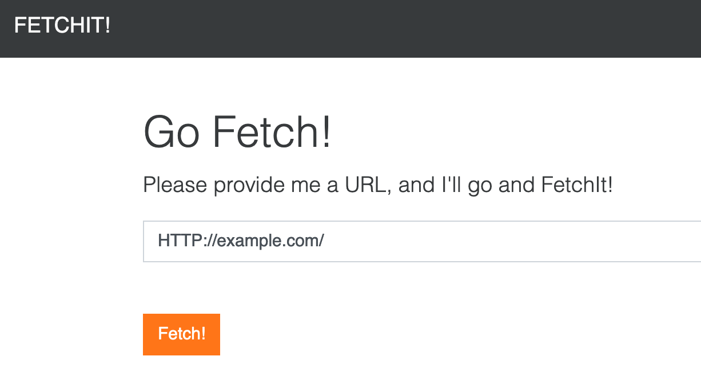

# 03 Fetchit

I created a basic application to allow users to fetch webpages and resources and render source for basic diagnostics in my appliance web interface. I've heard of users doing bad things with different protocol handlers in the past, so I made sure users can only fetch HTTP and HTTPS URLs.

## Design

The challenge links to a webpage that has a single text input to input a URL and a button to fetch the content at that location.



Clicking the button will load another page that displays the content of the URL.

## Write-up

Since the challenge text described "different protocol handlers" and called out HTTP and HTTPS, I assumed that perhaps this challenge required using file:// to fetch a local file containing the flag, which would then be displayed on the second page.

If this did require displaying a file containing the flag from the server, we'd also need to know the proper path to the flag file. Since the previous challenge used the path /home/challenge/flag.txt I had assume this one would be in the same location.

As expected, the page refused to accept a URL like file:////home/challenge/flag and displayed an error on the second page "Nice try, but only HTTP or HTTPS URL schemes are supported!".

Although they were likely filtering the initial URL, I suspected they were using an off-the-shelf library, such as python's requests, and may leave an option on to follow redirects. Doing so they probably can't (or don't know to) check the protocol scheme of those locations.

I host my own webserver using nginx, so I added a temporary new redirect statement to the server block of the configuration:

```
server {
    listen 80 default_server;

    root /var/www/html;

    [...]

    rewrite ^/foo$ file:////home/challenge/flag permanent;
}
```

Now any request to /foo of my webserver would return file:////home/challenge/flag as the next location.

I had try flag.txt but that didn't work, but the filename flag on its own worked.

The challenge website accepted my URL and displayed the local file contents.

flag{USers_4nD_urls-Ar3_NOt_t0_b3_TruSted}
